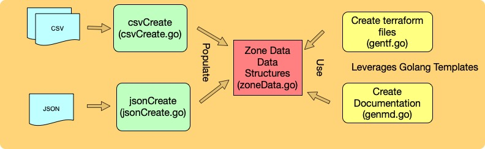

## terraform-dns
Generate GCP DNS terraform files from a text file.

- [CSV or JSON](#csv-or-json)
  * [CSV Format](#csv-format)
  * [JSON Format](#json-format)
- [Example Directory](#example-directory)
- [Program layout](#program-layout)

-----

**Purpose**

terraform code for managing DNS records can be daunting due to the fact that each zone record is a separate module definition. Managing records in a simple text file makes the task easier.

One of the other advantages is automatic creation of a documentation set that describes the DNS zone.

----

## CSV or JSON

There are two ways to manage DNS zone information. It can either be managed in JSON or CSV format. I started the project using a set of csv files but moved over to json representation while keeping the csv implementation.

*terraform-dns jsonCreate*
- generates files using the json representation of the zone

*terraform-dns csvCreate
- generates files using the csv representation of the zone

**Caveats**

Currently there is a timing issue on initial creation of a zone which will result in an error when the terraform script is first applied. This is due to the fact that the zone creation will return before the zone is created and the subsequent application of zone records will result in error.


-------

### CSV Format ###

**zone.csv file**

The format of the zone.csv file is a standard csv file that has no header and is formated as follows:

```
"dns name of zone", "GCP ProjectID", "Description" 
```

**[Example zone.csv file.](example/zone.csv)**

**records.csv file**

The format of the records.csv file is a standard csv file that has no header and is formated as follows:

```
"hostname", "record type", "ttl", "rrdatas", "description"
```

**[Example records.csv file.](example/records.csv)**


*Note:* The rrdatas do not need to be escapsed as per terraform requirements. The rrdatas string is analyized for spaces and will escape the string if spaces are found.

----

### JSON Format ###

The complete zone information is managed in a single JSON file that has the following format :

```
{
  "DNSName": "dns name of zone",
  "ProjectID": "gcp project ID",
  "Description": "description of zone",
  "DNSRecords": [
    {
      "HostName": "hostname",
      "Type": "record type example "A"",
      "TTL": "time to live",
      "RRDatas": "rrdata block",
      "Description": "description"
    },
  ]
}
```

**[Example zone_info.json file.](example/zone_info.json)**

-------


## Example Directory

The example directory eamples of zone definition in JSON and CSV.

The example directory contains the following files:
- zone.csv - [example csv zone definition](example/zone.csv)
- records.csv - [example csv records definitions](example/records.csv)
- zone.json - [example json zone definition](example/zone.json)
- main.tf - [example generated terraform](example/main.tf)
- zone-info.md - [example generated documentation set for zone](example/zone_info.md)


**For CSV  maintained zone.**

The zone configuration is specified in the zone.csv. For this example, the zone.csv will generate terraform module definition for "roger.beathard.com" in the mydns project.

The records for the zone is specified in the records.csv file. There are 8 entries: "www", "azure", "home-red", "home-green", "aweb", "apple", "home-lb", & "home2".

**Re-generation of main.tf and zone-info.md from CSV**
```
../terraform-dns csv-create.
```

**For JSON maintained zone.**

There is only one configuration json file that maintains the zone information and its related records. 

**Re-generation of main.tf and zone-info.md files from JSON**

```
../terraform-dns json-create
```

---
## Program layout

The program is broken down into 3 layers: readers, data representative, producer. Separate modules are used to read either csv or json data files and populate a common data representative. The terraform or markdown files are generated in using separate modules via golang templates definitions.


